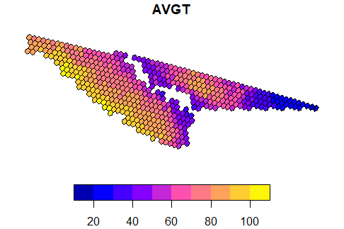

# Getting Started

In this example we try to connect to the `Netezza` and use `IDEAS` data model to perform a few simple analytics queries.

```r
library(DBI)
library(dplyr)
library(sf)
library(nzdggs)

# define init object and connection
DSN = nz_init("NZSQL","SPATIAL_SCHHEMA")
con = dbConnect(RNetezza::Netezza(), dsn=DSN$DSN_NAME)

# query data 
data=tbl(con,"ANUSPLINE3")
datap=data%>%filter(KEY=='PRECIPITATION')

# manipulate data
datap=datap%>%mutate(VALUE=VALUE+1)%>%show_query()
# average them
avgs=datap%>%group_by(TID)%>%arrange(TID)%>%summarise(AVGS=mean(VALUE))%>%head(10)
avgt=datap%>%group_by(DGGID)%>%summarise(AVGT=mean(VALUE))

# For plotting we get finalgrid
grid=tbl(con,"FINALGRID2")

# join average with final grid on DGGID column
out=avgt%>%inner_join(grid,by=c('DGGID'))%>%mutate(WKT=inza..ST_AsText(GEOM))%>%
  select(DGGID,AVGT,WKT)%>%arrange(DGGID)%>%head(100)%>%collect()

# convert to sf object
poly=st_as_sf(out, wkt='WKT', crs = 4326)

#plot them
plot(poly['AVGT'])

head(data)
```
